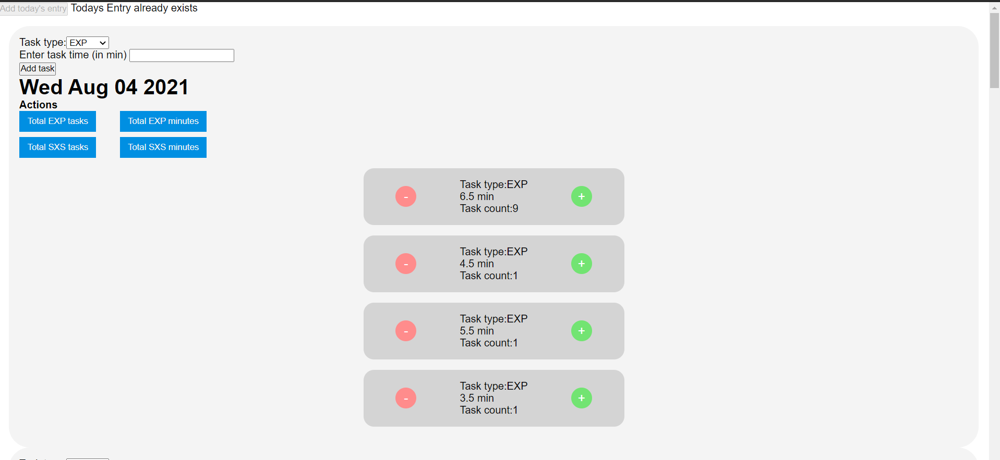

# LB Tasks counter

An application for all lionbridge raters, to keep track of their 
tasks and easily copy the required data with one click.

## Preview

## Libraries used

- Redux Toolkit

## Live demo

[Click here](https://loving-heisenberg-09e3a3.netlify.app/)

## Getting Started

- Clone the repo `https://github.com/iam-Akshat/lb-tasks-counter.git`
- `cd` into the project
- Run `npm install` to install all the dependencies
- Run `npm start`

## Deployment
 This is uploaded on Netlify. Check out Netlify for how to deploy your own version.

## Testing
- TODO

## Authors

👤 **Akshat Sethi**

- Github: [iam-Akshat](https://github.com/iam-Akshat)
- Twitter: [Akshat Sethi](https://twitter.com/akshatsethi)
- LinkedIn: [Akshat Sethi](https://linkedin.com/in/akshatsethi)

## Contributing

- Fork the project
- Create your feature branch `git checkout -b awesome-feature`
- Commit your changes `git commit -m 'Awesome feature'`
- Push it `git push -u origin awesome-feature`
- Open a pull request using this branch

## Show your support

Give a ⭐️ if you like this project!
